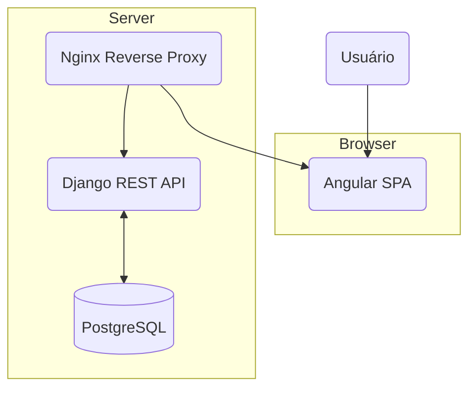

# Arquitetura do Projeto - Portfolio Ésley Nathan

**Última atualização**: 2025-12-05

Este documento descreve a arquitetura de software, a stack tecnológica e as decisões de design importantes do projeto.

---

## 1. Visão Geral da Arquitetura

O projeto segue uma arquitetura **API-first** com uma clara separação de concerns (SoC) entre o backend e o frontend.

- **Backend (API RESTful)**: Uma API stateless desenvolvida com Django e Django REST Framework. É responsável por toda a lógica de negócio, manipulação de dados e autenticação. Serve conteúdo dinâmico via endpoints JSON.
- **Frontend (Single Page Application)**: Um cliente rico e interativo desenvolvido com Angular. Consome a API do backend para exibir os dados e interagir com o usuário. É totalmente desacoplado do backend.
- **Containerização**: Ambos os serviços, junto com o banco de dados, são containerizados com Docker, garantindo um ambiente de desenvolvimento e produção consistente e isolado.

---

## 2. Stack Tecnológica

### Backend
- **Linguagem**: Python 3.11+
- **Framework**: Django 5.0+, Django REST Framework
- **Banco de Dados**: PostgreSQL (produção), SQLite (desenvolvimento)
- **Servidor**: Gunicorn (produção)

### Frontend
- **Framework**: Angular 17+
- **Linguagem**: TypeScript
- **Estilização**: Tailwind CSS 3 (Utility-First)
- **Estado e Reatividade**: RxJS

### DevOps
- **Containerização**: Docker, Docker Compose
- **CI/CD**: GitHub Actions (planejado)
- **Proxy Reverso**: Nginx

---

## 3. Decisões Arquiteturais (ADRs)

Esta seção documenta as principais decisões técnicas e o porquê delas.

- **ADR-001: Escolha de Frameworks (Angular + Django)**
  - **Contexto**: Necessidade de um frontend robusto e um backend rápido de desenvolver.
  - **Decisão**: Utilizar Angular para o frontend e Django REST Framework para o backend.
  - **Justificativa**: Angular oferece uma solução completa e escalável ("batteries-included") com TypeScript e RxJS. Django, com seu Admin e ORM, permite um desenvolvimento de API extremamente rápido e seguro. A combinação é ideal para projetos que exigem estrutura e produtividade.

- **ADR-002: Escolha de Estilização (Tailwind CSS)**
  - **Contexto**: Necessidade de um sistema de design customizável, rápido e que não dependa de bibliotecas de componentes de terceiros.
  - **Decisão**: Adotar Tailwind CSS.
  - **Justificativa**: A abordagem utility-first permite criar designs complexos sem sair do HTML, acelera o desenvolvimento responsivo e gera um CSS final otimizado e pequeno. Evita a "guerra de especificidade" de CSS tradicional.

- **ADR-003: Separação Backend/Frontend**
  - **Contexto**: Garantir manutenibilidade e escalabilidade a longo prazo.
  - **Decisão**: Implementar uma arquitetura estritamente desacoplada (headless).
  - **Justificativa**: Permite que o frontend e o backend evoluam de forma independente. Facilita a criação de novos clientes (ex: um app mobile) consumindo a mesma API. Simplifica o deploy e o dimensionamento de cada parte separadamente.

*Nota: As "Lições Aprendidas" no `STATUS.md` servem como um registro informal de outras decisões e aprendizados.*