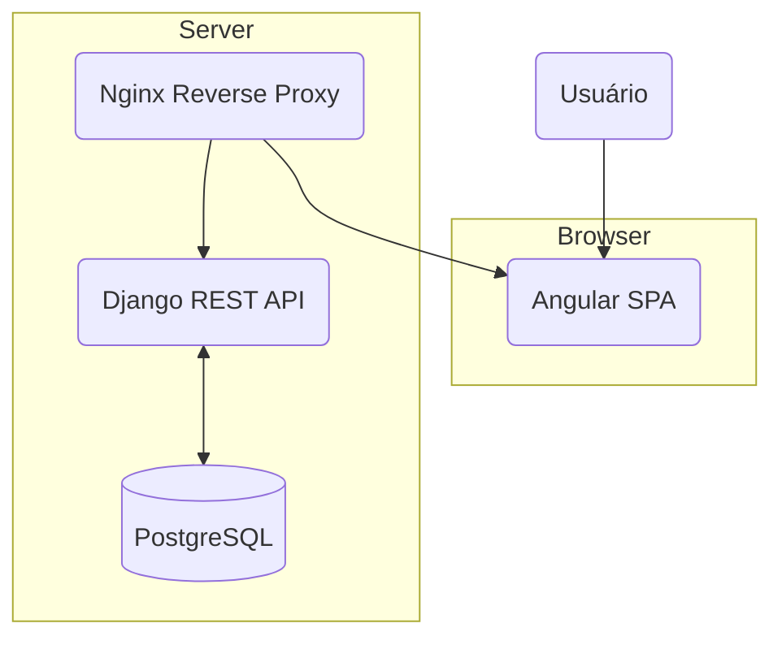
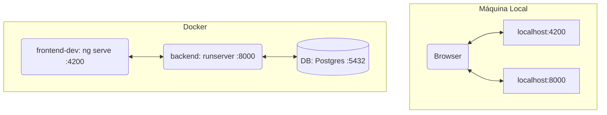
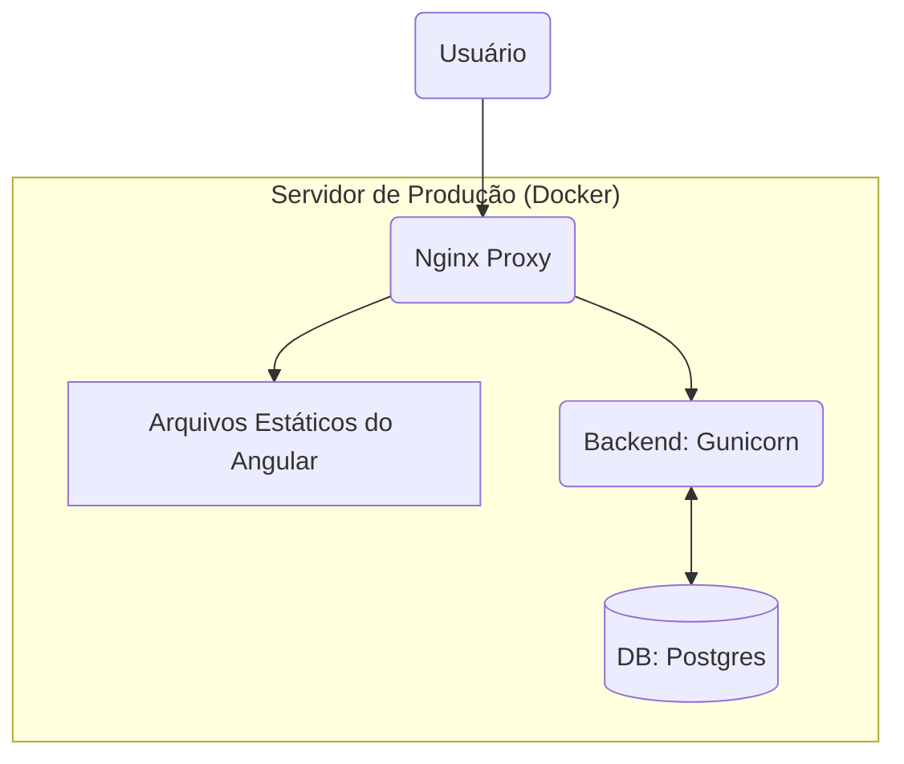

# Arquitetura do Projeto - Portfolio Ésley Nathan

**Última atualização**: 2025-12-05

Este documento descreve a arquitetura de software, a stack tecnológica e as decisões de design importantes do projeto.

---

## 1. Visão Geral da Arquitetura

O projeto segue uma arquitetura **API-first** com uma clara separação de concerns (SoC) entre o backend e o frontend.

- **Backend (API RESTful)**: Uma API stateless desenvolvida com Django e Django REST Framework. É responsável por toda a lógica de negócio, manipulação de dados e autenticação. Serve conteúdo dinâmico via endpoints JSON.
- **Frontend (Single Page Application)**: Um cliente rico e interativo desenvolvido com Angular. Consome a API do backend para exibir os dados e interagir com o usuário. É totalmente desacoplado do backend.
- **Containerização**: Ambos os serviços, junto com o banco de dados, são containerizados com Docker, garantindo um ambiente de desenvolvimento e produção consistente e isolado.

---

## 2. Stack Tecnológica

### Backend
- **Linguagem**: Python 3.11+
- **Framework**: Django 5.0+, Django REST Framework
- **Banco de Dados**: PostgreSQL (desenvolvimento e produção)
- **Servidor**: Gunicorn (produção)

### Frontend
- **Framework**: Angular 17+
- **Linguagem**: TypeScript
- **Estilização**: Tailwind CSS 3 (Utility-First)
- **Estado e Reatividade**: RxJS

### DevOps
- **Containerização**: Docker, Docker Compose
- **CI/CD**: GitHub Actions (planejado)
- **Proxy Reverso**: Nginx

---

## 3. Decisões Arquiteturais (ADRs)

Esta seção documenta as principais decisões técnicas e o porquê delas.

- **ADR-001: Escolha de Frameworks (Angular + Django)**
  - **Contexto**: Necessidade de um frontend robusto e um backend rápido de desenvolver.
  - **Decisão**: Utilizar Angular para o frontend e Django REST Framework para o backend.
  - **Justificativa**: Angular oferece uma solução completa e escalável ("batteries-included") com TypeScript e RxJS. Django, com seu Admin e ORM, permite um desenvolvimento de API extremamente rápido e seguro. A combinação é ideal para projetos que exigem estrutura e produtividade.

- **ADR-002: Escolha de Estilização (Tailwind CSS)**
  - **Contexto**: Necessidade de um sistema de design customizável, rápido e que não dependa de bibliotecas de componentes de terceiros.
  - **Decisão**: Adotar Tailwind CSS.
  - **Justificativa**: A abordagem utility-first permite criar designs complexos sem sair do HTML, acelera o desenvolvimento responsivo e gera um CSS final otimizado e pequeno. Evita a "guerra de especificidade" de CSS tradicional.

- **ADR-003: Separação Backend/Frontend**
  - **Contexto**: Garantir manutenibilidade e escalabilidade a longo prazo.
  - **Decisão**: Implementar uma arquitetura estritamente desacoplada (headless).
  - **Justificativa**: Permite que o frontend e o backend evoluam de forma independente. Facilita a criação de novos clientes (ex: um app mobile) consumindo a mesma API. Simplifica o deploy e o dimensionamento de cada parte separadamente.

*Nota: As "Lições Aprendidas" no `STATUS.md` servem como um registro informal de outras decisões e aprendizados.*

---

## 4. Ambientes de Execução (Docker)

O projeto utiliza Docker e Docker Compose para criar ambientes de desenvolvimento e produção consistentes e isolados. Essa abordagem garante que a aplicação se comporte da mesma forma no ambiente local do desenvolvedor e no servidor de produção.

### 4.1. Estrutura de Arquivos

-   **`docker-compose.yml`**: Arquivo base que define os serviços para o ambiente de **produção**.
-   **`docker-compose.override.yml`**: Sobrescreve e adiciona configurações ao arquivo base para criar o ambiente de **desenvolvimento**, habilitando hot-reloading e portas de acesso direto.
-   **`backend/Dockerfile`**: Usado para construir a imagem do backend. Ele é multi-propósito:
    -   Em **desenvolvimento**, instala as dependências e roda o servidor de desenvolvimento do Django (`runserver`).
    -   Em **produção**, é usado para rodar a aplicação com o servidor WSGI Gunicorn.
-   **`frontend/Dockerfile`**: Usado para construir a imagem de **produção** do frontend. É um *multi-stage build* que primeiro compila a aplicação Angular e depois serve os arquivos estáticos resultantes com Nginx.
-   **`frontend/Dockerfile.dev`**: Usado exclusivamente para o ambiente de **desenvolvimento** do frontend. Instala as dependências e prepara o ambiente para rodar o servidor de desenvolvimento do Angular (`ng serve`) com hot-reloading.

### 4.2. Contêineres por Ambiente

Tanto em desenvolvimento quanto em produção, a arquitetura é composta por **3 contêineres**, mas com propósitos e configurações distintas.

#### Ambiente de Desenvolvimento (`docker-compose up`)

Otimizado para produtividade e hot-reloading. O `docker-compose.override.yml` é usado para:
1. Adicionar um serviço `frontend-dev` que roda o servidor de desenvolvimento do Angular.
2. Sobrescrever o comando do serviço `backend` para usar o `runserver` com hot-reload.
3. Desabilitar o serviço `nginx` de produção.

1.  **`portfolio-db` (PostgreSQL)**: O banco de dados.
2.  **`portfolio-backend` (Django `runserver`)**: Roda o servidor de desenvolvimento do Django. O código-fonte local é montado como um volume, permitindo que o servidor reinicie automaticamente a cada alteração.
3.  **`frontend-dev` (Angular `ng serve`)**: Roda o servidor de desenvolvimento do Angular. O código-fonte local também é montado como um volume, refletindo as alterações de UI instantaneamente no navegador.

#### Ambiente de Produção (`docker-compose -f docker-compose.yml up`)

Otimizado para performance, segurança e escalabilidade.

1.  **`portfolio-db` (PostgreSQL)**: O mesmo banco de dados.
2.  **`portfolio-backend` (Django com Gunicorn)**: Roda a aplicação Django com Gunicorn, um servidor WSGI robusto para produção. Não há hot-reloading; ele serve a versão "congelada" da aplicação no momento do build da imagem.
3.  **`portfolio-nginx` (Nginx)**: Atua como o ponto de entrada para o tráfego web. Ele tem duas responsabilidades:
    -   Servir os arquivos estáticos da aplicação Angular (que foram compilados durante o build da imagem `frontend/Dockerfile`).
    -   Atuar como **proxy reverso**, redirecionando chamadas para `/api` para o contêiner `portfolio-backend`.

